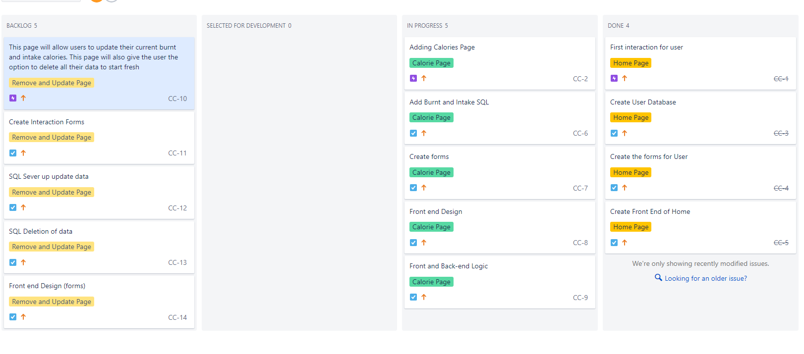
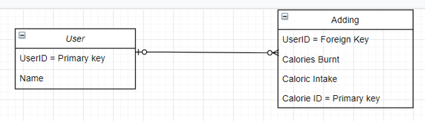
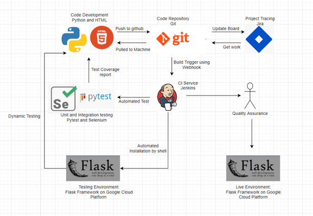
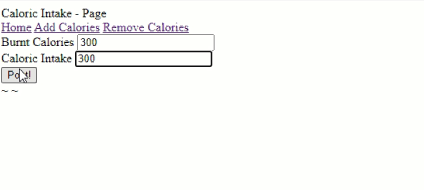
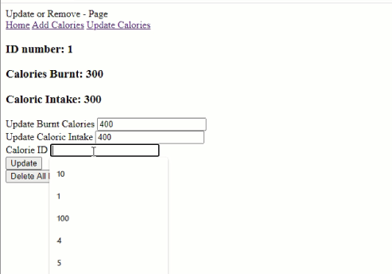
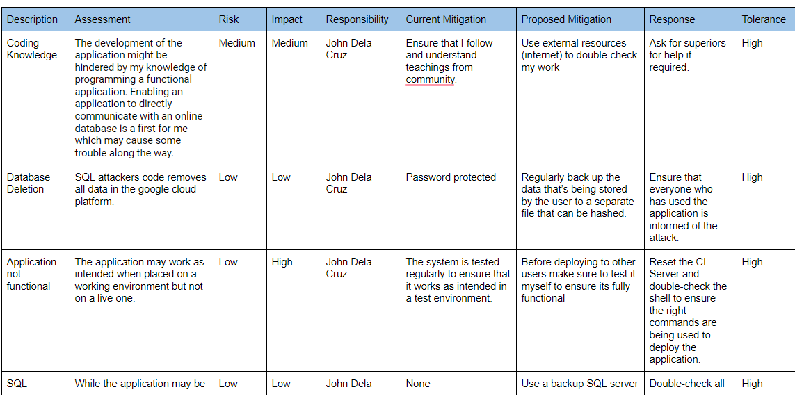
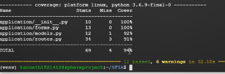
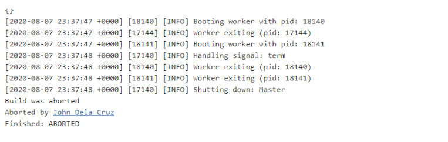
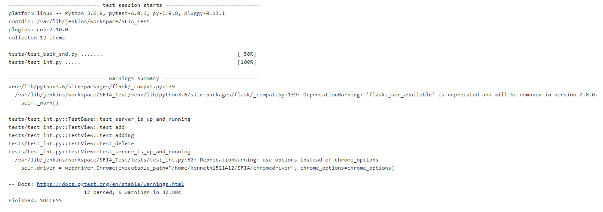

# SFIA PROJECT: Calorie Diary
This project purpose is to ensure that we are capable of creating an application which has all the CRUD functionality. The application I have created enables users to take not of their caloric intake and calories burnt for the day. Each data the user inputs will be stored in a SQL server which is hosted in Google Cloud Platform. By doing so we can apply the fundementals of creating, reading, updating and deleting into our SQL database as well. Furthermore I had to build the applicaiton using Jenkins which is my CI Server which handles the automation or testing and deployment.

## Contents:
* Traking my Progress
* Designs
* How to run the application
* Home Page
* Add Page
* Remove and Update Page
* Risk Assesssment
* Coverage (Unit Test) and Integration
* Known Issues
* Future improvements

# Traking my Progress:
We had the option to choose between trello and jira, I had chosen to use jira for it was the more familiar service for me. Here I broke down the core components of the application to ensure that the right epics where written and each task were appropriate. These each task are broken down into user stories to ensure that I had included everything a a user will need to do in the applcation. 

# Designs:
In the link bellow are images to display the design of the application. Before developing the application the Design of the Database was considered greatly to ensure that data application have 1 to many relationship. I had 2 tables; User and Adding. The User table will store the user_ID and name, the application already creates a user when accessing the home page to ensure that we have a foreign key for Adding. The Adding table will hold the calorie_id, burnt calories, caloric intake and owner_id. The owner_id is the foreign key which is establish a relationship with the User table. To get a clearer understanding please check the link bellow.

Another Design we had to take into account was the CI pipeline. This is to show the project timeline and display the techonologies used for the application. The source code will be Python and HTML for the HTML will help display the fornt end of the application while the python handles the back end processing. The repository is git while my project tracker as mentioned was Jira. Becasue python already had a build in module for unit test called pytest I had decided to implement this as well as integration testing using selenium to ensure a that the project is thoroughly tested in each aspects. The CI Server chosen was jenkins for it enables me to automate my testing and releases between builds when updating my codebase via webhook. As a test environment I had deployed it using Guniorn to simulate multiple users accessing the application.

# How to run the application:
You'll first need to clone this repository into your local machine. Then you'll need to export the database URI and Secret key. Use the text bellow and replace what is necessary. Ensure that on the database URI you have the correct IP address for your SQL server. If not then it'll not work. You will not need to create you tables in your database. The application can do this just run: Python3 app.py. Make sure to check your SQL server first to see if the tables are created. Then you are ready to run the application: Python3 app.py. All you'll have to do now is paste the IP address of your machine with port 5000/home to access the app. (also in the written bellow)

export DATABASE_URI="mysql+pymysql://root:(sql_server_password)@(SQL_IP_ADDRESS):3306/appdb"
export MY_SECRET_KEY=dunirufnsk
(VM_IP_ADDRESSS):5000/home

# Home Page
This is what the home page shoud look like. The only available buttons are the navigation bar, which directs the user to the add and remove page. 

# Add Page
Here the user can use the input forms to add data into the sql using the forms provided in the page. The data is then handed to the SQL server using session.add().

# Remove and Update Page
Here the user can update their current data or remove everything entirely. This also displays any data the user might have wanted to include. Once we have type the data we want to change it to, we can then commit this data. If we use add this will only create a new data into the SQL server. Using the owner_id we can identify which data need to be ammended. We can also delete all data in the table by querying the database and use seession.query(table).delete.

# Risk Assesssment
This is a screenshot of some Risk assessments that were considered. To see the full list click on the link bellow the image to a google drive doc.

https://docs.google.com/document/d/1Gjxqt4aygS_DBByJajkESILNK2yp-1UGWnnEPR8EmQc/edit

# Testing: Coverage (Unit Test) and Integration
This is the test resuts of the results that were run in jenkins and the vm machine to see if the application is full functional. The dynamic test was done using Gunicorn to simulate multiple users. In the screenshot it shows 2 workers using the application simultaneously.
The reason why the application was capable of reaching up to 94% coverage on unit testing was because every function in the pages of the application was tested. These included the buttons for the navigation, submit and deletion button. I also tested the input forms by using string varibles to be placed in them to simulate a real person's interaction with the application. Any test that has failed will be noted at the end of the test. As you can see on the screen shot it shows that it has passed all 12 test cases. 

The screenshot above shows the Unit Test and Integration testing working fine in jenkins. The purpose of the integration test is to test the applications functionality by simulating a human. Not only is this method quicker it is also repeatable. The integration test tested all buttons of the applicaiton using xpath and click to ensure they were functional and takes users to the right pages. The form input was also tested using send_keys which simulates a user key presses to ensure that correct data was implemneted.

# Known Issues:
There is no way of adding a user manually, it is all done by the algorithm written.
You cannot delete individual data, you can only delete it entirely
The applciation wouldn't deploy using systemd but can be deployed using Gunicorn and Flask run --host=0.0.0.0

# Future improvements:
Enable the system to have a login and create users 
Add a function to delete individual post rather than deleting entire data
Fix the issue with systemd so that it can be deployed autonomously without needing to build in jenkins

